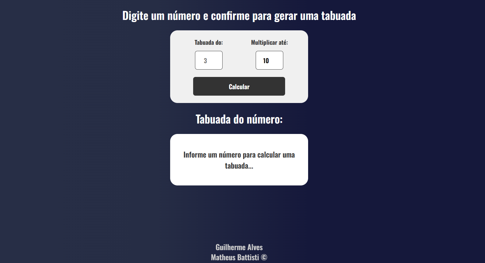

# Calc_JS
> Calculadora de multiplicação




## 📌 Funcionalidades
- 🔹 Responsivo
- 🔹 Interativo

## 🚀 Tecnologias Utilizadas
- HTML
- CSS
- JavaScript

## 📂 Como Usar
```bash
# Clone este repositório
git clone https://github.com/DevsAlves/Tabuada_JS.git


# Abra o arquivo index.html no navegador
```


## 📝 Licença
Este projeto está sob a licença [Matheus Battisti].

---
Feito com 💙 por [Guilherme Alves](https://github.com/DevsAlves) 🚀

